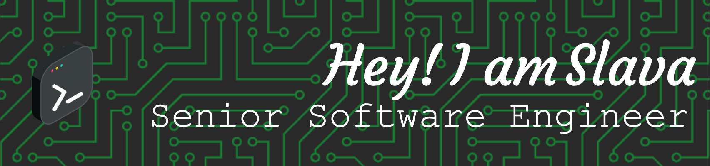

<!-- Banner image (optional, replace with your own or remove) -->

  

  

---

### 🛠️ Languages & Tools

  
  
  
  
  
  
  
  
  
  
  
  
  <!-- Add more as needed -->

---

### 📈 GitHub Stats

  

---

### 🤝 Connect with me

  

